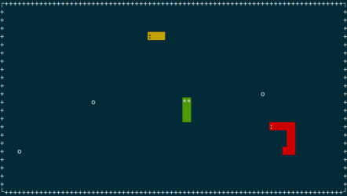

# Multiplayer Snakes Game
[](https://travis-ci.org/drmenguin/snakes)
[](https://opensource.org/licenses/MIT)

This game is a programming assignment for [CPS2003: Systems Programming](http://www.um.edu.mt/ict/studyunit/CPS2003), a course forming part of my B.Sc. in Mathematics and Computer Science. 

<p align="center">  </p>

## Requirements
This program uses [Berkeley sockets](https://en.wikipedia.org/wiki/Berkeley_sockets) together with other Unix/Linux kernel data structures, and therefore only functions properly on terminals in a Unix environment. On Ubuntu (or any Debian system running apt), you can check whether you have `ncurses` installed, by running

```
apt -qq list ncurses-bin ncurses-base
``` 
in a terminal window. If `ncurses` is present, the output should produce two lines with the tag `[installed]` at the end. If no output is produces, then `ncurses` is not present and you need to install it by running
```
sudo apt-get install ncurses-dev
```
in a terminal window.

## Instructions
Clone the repository and run `make` to generate the server and client programs. Run the server (occupying port 7070) on a machine which is accessible to all clients. 

Clients connect to the server by running 
```
./client <server-ip>
```
in a terminal window, whose size must be at least 80 × 24 cursors. 
